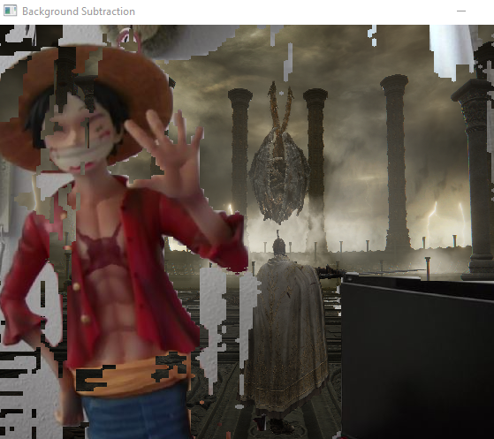

# 🧠 My Project Portfolio

Welcome to my OpenCV_Projects! This repository serves as an index of my key projects, covering topics from 3D computer vision to machine learning utilities. Below you'll find a list of each project with a short summary.

---

## 📁 Project Index

1. [3D Reconstruction](#-3d-reconstruction)
2. [Background Subtraction](#-background-subtraction)
3. [Image Stitching](#-image-stitching)
4. [Machine Learning](#-machine-learning)
5. [Utils](#-utils)

---

## 🔷 3D Reconstruction

> Tools and algorithms for reconstructing 3D scenes from multiple images.  
As of now it includes techniques like depth estimation and point cloud generation.

> Following is the 3D Stereo estimation using OpenCV's Stereo SGBM. Dataset and camera calibrations used in this project can be found here [Backpack-perfect scene](https://vision.middlebury.edu/stereo/data/scenes2014/datasets/Backpack-perfect/) 

> ### Result for Stereo SGBM:

> 📌 **Note:** Visualisation and generation of ply file that holds the 3d data were both done via Open3d library. Code is supplied.

📂 Folder: `3d_reconstruction`

---

## 🔶 Background Subtraction

> Implements foreground/background segmentation techniques using classical and learning-based methods.  
Useful for video analysis, surveillance, and motion tracking.
> As of now there is only patch-based approach, which is to be honest not that affective with an old web cam and bad illumination.
> ### Result for patch-based approach

> 📌 **Note:** Requires the image of background without the actual subject in it (yeah its old tech).

📂 Folder: `Backgroundsubtraction`

---

## 🧵 Image Stitching

> Algorithms to stitch multiple images into a seamless panorama.  
Includes feature matching, homography estimation, and blending.

📂 Folder: `Imagestitching`

---

## 🧠 Machine Learning

> A collection of machine learning projects and experiments.  
Includes supervised, unsupervised, and deep learning models for various tasks.

📂 Folder: `ML`

---

## 🧰 Utils

> Utility scripts and helper functions used across various projects.  
May include image processing tools, data loaders, or visualization aids.

📂 Folder: `Utils`

---

## 📌 Notes

Feel free to explore each folder for code, documentation, and results.  
Updates and detailed descriptions coming soon!

---
